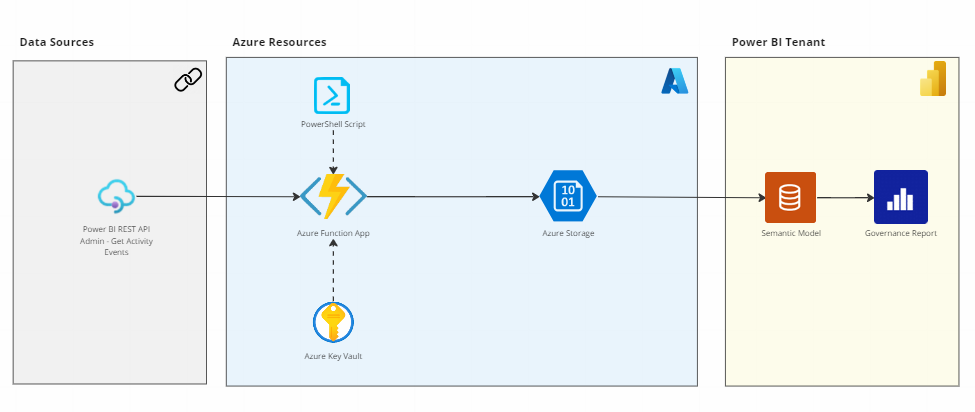
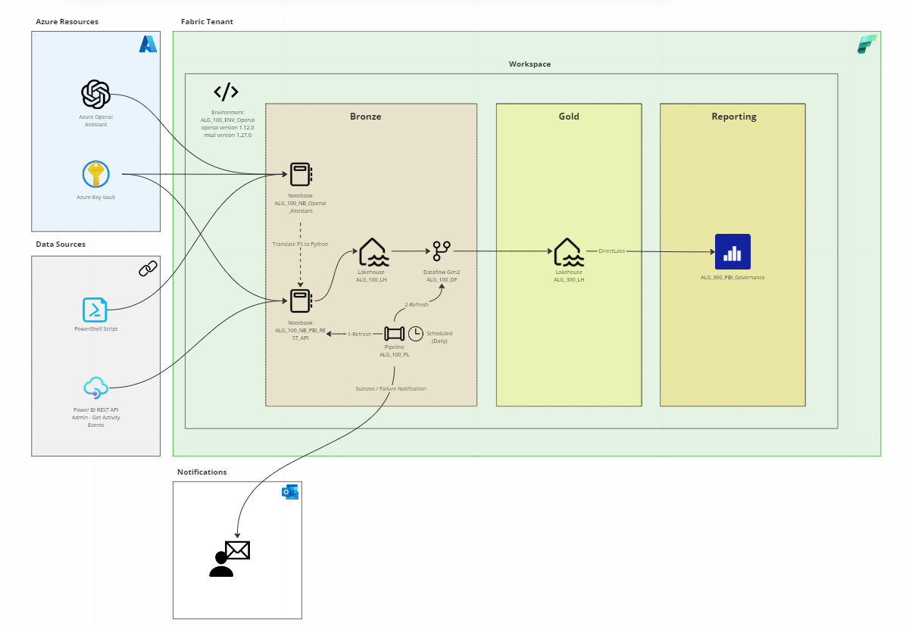
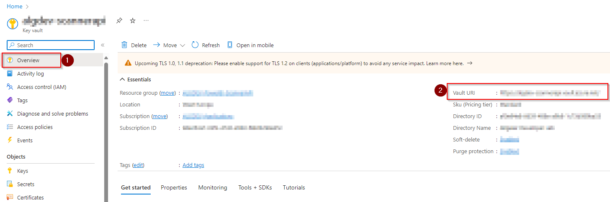
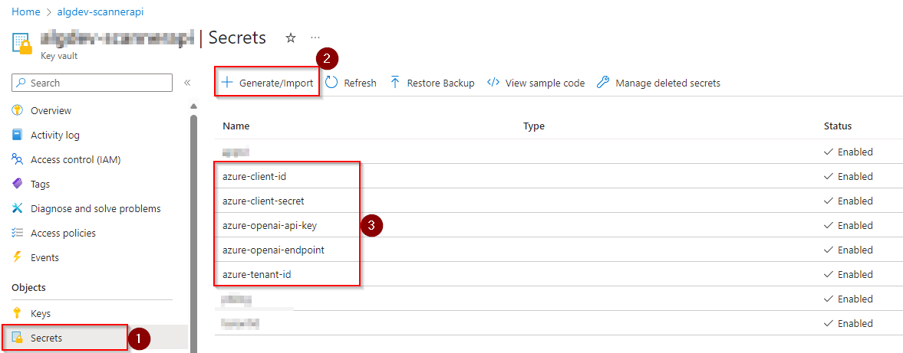
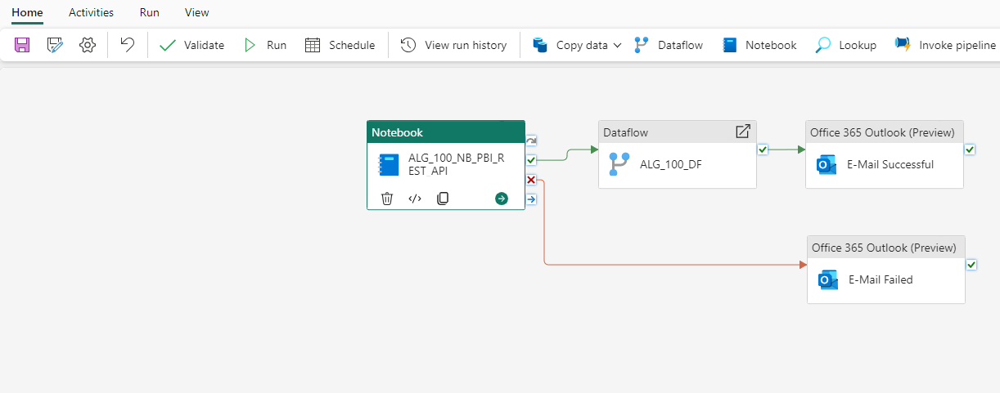

<!-- PROJECT SHIELDS -->
<!--
*** I'm using markdown "reference style" links for readability.
*** Reference links are enclosed in brackets [ ] instead of parentheses ( ).
*** See the bottom of this document for the declaration of the reference variables
*** for contributors-url, forks-url, etc. This is an optional, concise syntax you may use.
*** https://www.markdownguide.org/basic-syntax/#reference-style-links
-->
[![Contributors][contributors-shield]][contributors-url]
[![Forks][forks-shield]][forks-url]
[![Stargazers][stars-shield]][stars-url]
[![Issues][issues-shield]][issues-url]
[![MIT License][license-shield]][license-url]
[![LinkedIn][linkedin-shield]][linkedin-url]

<!-- ABOUT THE PROJECT -->
# Fabric Activity Cockpit
## Introduction

The objective of this solution is to create a Fabric architecture that uses the Power BI REST API to import PBI tenant-level activity metadata ([Admin - Get Activity Events](https://learn.microsoft.com/en-us/rest/api/power-bi/admin/get-activity-events)).

This information gives Fabric Admins a birds-eye view of the activities being undertaken within the Fabric tenant related to Power BI artifacts and whether this conforms with company governance policies.

Allowing questions such:

1. What is the overall activity trend?
2. How much activity was there per workspace, dataset, dataflow, datamart, report and/or app?
3. Which type of activity, when, by whom and where was it executed?
4. How many days of inactivity have there been?

This can also be extended with additional API calls. To view the full catalog, take a look at the [Power BI REST API](https://learn.microsoft.com/en-us/rest/api/power-bi/) overview. For a more detailed look at what can be achieved, checkout this [Admin API Blog](https://powerbi.microsoft.com/en-us/blog/announcing-new-admin-apis-and-service-principal-authentication-to-make-for-better-tenant-metadata-scanning/).

(<a href="#readme-top">back to top</a>)

<!-- GETTING STARTED -->
## Background

Before the advent of Fabric, the aforementioned solution could be achieved using a combination of Azure Function App, Azure Key Vault and Power Shell scripts to authenticate and call the Power BI REST API and save the data into Azure Storage in a scheduled manner.

The primary objective of this architecture, apart from automatically importing the API data, was to save historical values since the API only kept metadatalogs for up to 30 days.

  

**Architecture Overview (Original Version)**

The architecture setup:

(<a href="#readme-top">back to top</a>)

## Objective

Our goal was to create a solution that replicated the original architecture, directly in Fabric. 

By doing so, PBI Admins have the ability to manage the setup within the Fabric tenant they oversee, avoiding or at least minimizing the need to work with Azure resources such as Azure Function App and Azure Storage.

To achieve this, we first needed to transform the Power Shell scripts into Python to run the code in Fabric Notebooks. We used Azure Openai Assistants with code interpreter to help us translate the scripts into Python. This section substitutes the need for Azure Function App with Power Shell scripts.

Next, we create a (partial) medallion structure comprised of a bronze and gold layer within our Fabric workspace. Each layer is made up of a Lakehouse. Additionally, we use a Dataflow Gen2 to carry out any data transformations in the bronze layer before making the data available in the gold layer. This section substitutes the Azure Storage.

Finally, all these pieces are refreshed in sequence using a pipeline. Additonally, there is an E-Mail trigger that sends the status (success or failiure) of the pipeline once the run is finished.

  

### What is a Medallion Structure?

The medallion structure is usually comprised of three layers that denote the quality of the data being stored.

The three layers are:

- Bronze (raw)
- Silver (transformed and enriched)
- Gold (aggregated)

In our case, we will dispense with the silver layer since transformations will be achieved directly in the Dataflow Gen2.

  

**Architecture Overview (New Version)**

The architecture setup in Fabric will follow the workflow of the diagram below:

 

(<a href="#readme-top">back to top</a>)

## Getting Started

Even though we want to avoid using Azure Resources, we will need to configure three things within Azure: Service Principal, Azure Key Vault and Azure Openai.

**Note: that since we are using Azure Openai Assistants with code interpreter, the Resource Group must reside in the Sweden Central, Australia East or East US 2. To view the latest developments see [Azure Openai Assistant Regions](https://learn.microsoft.com/en-us/azure/ai-services/openai/concepts/models#assistants-preview)**

Azure

1. Create a Service Principal. This is required to authenticate and grant the API call access to your Fabric tenant. For more information, see [Azure Service Principal](https://learn.microsoft.com/en-us/power-bi/developer/embedded/embed-service-principal)
2. Create a Resource Group in your Azure Subscription. Within your Resource Group:
   - Create a Azure Key Vault. This resource will hold your secrets, specifically your Azure Openai and Service Principal credentials. Make sure to grant the user running the Fabric Notebook GET access to these secrets. For more information, see [Azure Key Vault](https://learn.microsoft.com/en-us/azure/key-vault/secrets/quick-create-portal).
   - Create an Azure Openai Service and deploy the LLM model GPT-4 (1106-preview). Name this model deployment gpt-4-1106-preview. For more information, see [Azure Openai Assistants Quick Start](https://learn.microsoft.com/en-us/azure/ai-services/openai/assistants-quickstart?tabs=command-line&pivots=programming-language-studio)

Fabric

1. Create a Fabric Workspace and within this workspace:
   - Create two Fabric Notebooks (import the ipynb notebooks [ALG_100_NB_Openai_Assistant][ALG_100_NB_Openai_Assistant] and [ALG_100_NB_PBI_Rest_API][ALG_100_NB_PBI_Rest_API])
   - Create two Fabric Lakehouses (ALG_100_LH and ALG_300_LH)
   - Create one Fabric Pipeline (ALG_100_PL)
   - Create one Fabric Dataflow Gen2 (import the JSON template [ALG_100_DF][ALG_100_DF])

  

### Fabric Notebook

Change the Azure Key Vault URI in each notebook.

You can find your Azure Key Vault URI in the Azure Portal under the overview page of the Azure Key Vault resource.

Make sure to name your secrets in the Azure Key Vault exactly as in the notebooks i.e. **azure-openai-endpoint, azure-openai-api-key, azure-client-id, azure-client-secret and azure-tenant-id**

If you're unsure where to find the Openai API Key (**azure-openai-api-key**) or Endpoint (**azure-openai-endpoint**), checkout the [Azure Openai Key and Endpoint](https://learn.microsoft.com/en-us/azure/ai-services/openai/quickstart?tabs=command-line%2Cpython&pivots=programming-language-python#retrieve-key-and-endpoint) documentation. 

For more information regarding your client (**azure-client-id** and **azure-client-secret**) and tenant (**azure-tenant-id**) information, see the [Azure Service Principal](https://learn.microsoft.com/en-us/power-bi/developer/embedded/embed-service-principal) documentation

### Fabric Pipeline
Here is what your pipeline should look like

Perfect! You're now ready to schedule your pipeline and have your API data imported, saved and transformed in your workspace. From here you can use your Data Lakehouse as a data source and create your own PBI reports!

(<a href="#readme-top">back to top</a>)

<!-- FILES -->
## Documentation, Data & Support Files

The following support files can be found in this repository:

**Fabric Notebooks**

- [ALG_100_NB_Openai_Assistant][ALG_100_NB_Openai_Assistant] is the notebook with the python code to create and run the Azure Openai Assistant
- [ALG_100_NB_PBI_Rest_API][ALG_100_NB_PBI_Rest_API] is the notebook with the python code to call the Power BI REST API and save it to your Fabric lakehouse

**Fabric Dataflow Gen2**

- [ALG_100_DF][ALG_100_DF] is the JSON template to create the Dataflow Gen2 that runs the data transformations.

To create Azure resources, you will require an Azure account. You can start a free 30 day trial, by following the documentation found [here][Creating-a-free-azure-account-part-1]

Have fun!

(<a href="#readme-top">back to top</a>)

<!-- CONTACT -->
## Contact

If there are any questions, feel free to reach out!

- Nicolas Rehder - nrehder@allgeier.ch
- Olga Dontsova - odontsova@allgeier.ch

(<a href="#readme-top">back to top</a>)

<!-- REFERENCES -->
## References

The following documentation was used to source the information contained in this repository

* [Azure Openai Assistants](https://learn.microsoft.com/en-us/azure/ai-services/openai/how-to/assistant)
* [Azure Openai Assistants Quick Start](https://learn.microsoft.com/en-us/azure/ai-services/openai/assistants-quickstart?tabs=command-line&pivots=programming-language-studio)
* [Azure Openai Assistant Regions](https://learn.microsoft.com/en-us/azure/ai-services/openai/concepts/models#assistants-preview)
* [Azure Openai Key and Endpoint](https://learn.microsoft.com/en-us/azure/ai-services/openai/quickstart?tabs=command-line%2Cpython&pivots=programming-language-python#retrieve-key-and-endpoint)
* [Azure Key Vault](https://learn.microsoft.com/en-us/azure/key-vault/secrets/quick-create-portal)
* [Azure Service Principal](https://learn.microsoft.com/en-us/power-bi/developer/embedded/embed-service-principal)
* [Medallion Structure](https://learn.microsoft.com/en-us/azure/databricks/lakehouse/medallion)
* [Power BI REST API](https://learn.microsoft.com/en-us/rest/api/power-bi/)
* [Admin API Blog](https://powerbi.microsoft.com/en-us/blog/announcing-new-admin-apis-and-service-principal-authentication-to-make-for-better-tenant-metadata-scanning/)
* [Admin - Get Activity Events](https://learn.microsoft.com/en-us/rest/api/power-bi/admin/get-activity-events)

(<a href="#readme-top">back to top</a>)

<!-- MARKDOWN LINKS & IMAGES -->
<!-- https://www.markdownguide.org/basic-syntax/#reference-style-links -->
[contributors-shield]: https://img.shields.io/github/contributors/AllgeierSchweiz/fabric-ai-hack-pbi-activity-cockpit.svg?style=for-the-badge
[contributors-url]: https://github.com/AllgeierSchweiz/fabric-ai-hack-pbi-activity-cockpit/graphs/contributors
[forks-shield]: https://img.shields.io/github/forks/AllgeierSchweiz/fabric-ai-hack-pbi-activity-cockpit.svg?style=for-the-badge
[forks-url]: https://github.com/AllgeierSchweiz/fabric-ai-hack-pbi-activity-cockpit/network/members
[stars-shield]: https://img.shields.io/github/stars/AllgeierSchweiz/fabric-ai-hack-pbi-activity-cockpit.svg?style=for-the-badge
[stars-url]: https://github.com/AllgeierSchweiz/fabric-ai-hack-pbi-activity-cockpit/stargazers
[issues-shield]: https://img.shields.io/github/issues/AllgeierSchweiz/fabric-ai-hack-pbi-activity-cockpit.svg?style=for-the-badge
[issues-url]: https://github.com/AllgeierSchweiz/fabric-ai-hack-pbi-activity-cockpit/issues
[license-shield]: https://img.shields.io/github/license/AllgeierSchweiz/fabric-ai-hack-pbi-activity-cockpit.svg?style=for-the-badge
[license-url]: https://github.com/AllgeierSchweiz/fabric-ai-hack-pbi-activity-cockpit/blob/master/LICENSE.txt
[linkedin-shield]: https://img.shields.io/badge/-LinkedIn-black.svg?style=for-the-badge&logo=linkedin&colorB=555
[linkedin-url]: https://www.linkedin.com/in/nicolas-a-rehder/

[product-screenshot]: images/screenshot.png
[Next.js]: https://img.shields.io/badge/next.js-000000?style=for-the-badge&logo=nextdotjs&logoColor=white
[Next-url]: https://nextjs.org/
[React.js]: https://img.shields.io/badge/React-20232A?style=for-the-badge&logo=react&logoColor=61DAFB
[React-url]: https://reactjs.org/
[Vue.js]: https://img.shields.io/badge/Vue.js-35495E?style=for-the-badge&logo=vuedotjs&logoColor=4FC08D
[Vue-url]: https://vuejs.org/
[Angular.io]: https://img.shields.io/badge/Angular-DD0031?style=for-the-badge&logo=angular&logoColor=white
[Angular-url]: https://angular.io/
[Svelte.dev]: https://img.shields.io/badge/Svelte-4A4A55?style=for-the-badge&logo=svelte&logoColor=FF3E00
[Svelte-url]: https://svelte.dev/
[Laravel.com]: https://img.shields.io/badge/Laravel-FF2D20?style=for-the-badge&logo=laravel&logoColor=white
[Laravel-url]: https://laravel.com
[Bootstrap.com]: https://img.shields.io/badge/Bootstrap-563D7C?style=for-the-badge&logo=bootstrap&logoColor=white
[Bootstrap-url]: https://getbootstrap.com
[JQuery.com]: https://img.shields.io/badge/jQuery-0769AD?style=for-the-badge&logo=jquery&logoColor=white
[JQuery-url]: https://jquery.com 

[Creating-a-free-azure-account-part-1]: https://github.com/AllgeierSchweiz/azure-data-lakehouse-lab/blob/main/series/Creating%20a%20Free%20Azure%20Account%20(Part%201%20of%201).md
[ALG_100_NB_Openai_Assistant]: https://downgit.github.io/#/home?url=https://github.com/fabric-ai-hack-activity-cockpit/blob/main/support/notebooks/ALG_100_NB_Openai_Assistant.ipynb
[ALG_100_NB_PBI_Rest_API]: https://downgit.github.io/#/home?url=https://github.com/fabric-ai-hack-activity-cockpit/blob/main/support/notebooks/ALG_100_NB_PBI_Rest_API.ipynb
[ALG_100_DF]: https://downgit.github.io/#/home?url=https://github.com/fabric-ai-hack-activity-cockpit/blob/main/support/notebooks/ALG_100_DF.json
