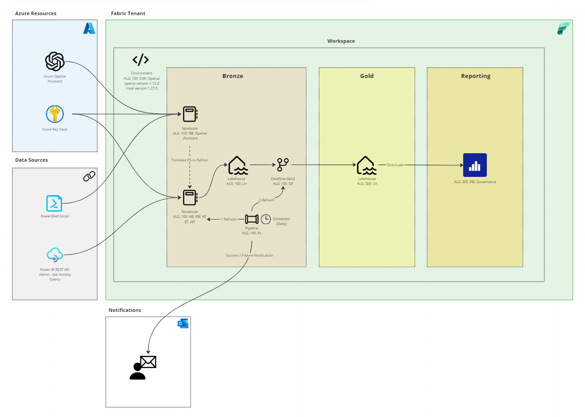

<!-- PROJECT SHIELDS -->
<!--
*** I'm using markdown "reference style" links for readability.
*** Reference links are enclosed in brackets [ ] instead of parentheses ( ).
*** See the bottom of this document for the declaration of the reference variables
*** for contributors-url, forks-url, etc. This is an optional, concise syntax you may use.
*** https://www.markdownguide.org/basic-syntax/#reference-style-links
-->
[![Contributors][contributors-shield]][contributors-url]
[![Forks][forks-shield]][forks-url]
[![Stargazers][stars-shield]][stars-url]
[![Issues][issues-shield]][issues-url]
[![MIT License][license-shield]][license-url]
[![LinkedIn][linkedin-shield]][linkedin-url]

<!-- ABOUT THE PROJECT -->
# Introduction

The objective of this solution is to create a Fabric architecture that uses the Power BI REST API to import PBI tenant-level activity metadata (activity events).

This information gives PBI Admins a birds-eye view of the activities being undertaken within the Fabric tenant and whether this conforms with company governance policies.

Allowing questions such:

1. What is the overall activity trend?
2. How much activity was there per workspace, dataset, dataflow, datamart, report, app.
3. Which type of activity, when, by whom and where was it executed?
4. How many days of inactivity have there been?

and many more to easily be answered!

(<a href="#readme-top">back to top</a>)

<!-- GETTING STARTED -->
# Initial Situation

Before the advent of Fabric, the aforementioned solution could be achieved using a combination of Azure Function App, Azure Key Vault and Power Shell scripts to authenticate and call the Power BI REST API and save the data into Azure Storage in a scheduled manner.

The primary objective of this architecture, apart from automatically importing the API metadata, was to save historical values since the API only kept metadatalogs for up to 30 days.

(<a href="#readme-top">back to top</a>)

**Architecture Overview (Original Version)**

The architecture setup:

# Objective

Our goal was to create a solution that replicated the original architecture mentioned in chapter initial situation, directly in Fabric. 

By doing so, PBI Admins have the ability to manage this architecture within the Fabric tenant they oversee, avoiding or at least minimizing the need to work with Azure resources such as Azure Function App, Azure Storage.

To achieve this, we first needed to transform the Power Shell scripts into Python to run the code in Fabric Notebooks. We used Azure Openai Assistants with code interpreter to help us translate the scripts into Python. This section substitutes the need for Azure Function App with Power Shell scripts.

Next, we create in our Fabric workspace a partial medallion structure comprised of a bronze and gold layer each made up of a Lakehouse. Additionally, we use a Dataflow Gen2 to carry out any data transformations in the bronze layer before making the data available in the gold layer. This section substitutes the Azure Storage.

Finally, all these pieces are refreshed in sequence using a pipeline.

## What is a Medallion Structure?

The medallion structure is usually comprised of three layers that denote the quality of the data being stored. Each layer is a folder directory inside the Azure Data Lake Storage. The three layers are:

- Bronze (raw)
- Silver (transformed and enriched)
- Gold (aggregated)

In our case, we will dispense with the silver layer since transformation will be achieved directly in the Dataflow Gen2.

**Architecture Overview (Original Version)**

The architecture setup in Fabric will follow the workflow of the diagram below:

*** 
 

(<a href="#readme-top">back to top</a>)

# Getting Started

Even though we want to avoid using Azure Resources, we will need to configure three things within Azure. 

Please note that since we are using Azure Openai Assistants with code interpreter, the Resource Group must reside in the region Sweden Central or US East 2.

Azure

1. Create a Service Principal. This is required to authenticate and grant the API call access to your Fabric tenant.
2. Create a Resource Group in your Azure Subscription. Within your Resource Group:
   - Create a Azure Key Vault. This resource will hold your secrets, specifically your Azure Openai and Service Principal credentials. Make sure to grant the user running the Fabric Notebook GET access to these secrets.
   - Create an Azure Openai Service and deploy the LLM model GPT-4 (1106-preview). Name this model deployment gpt-4-1106-preview. 

Fabric

1. Create a Fabric Workspace and within this workspace:
2. Create two Fabric Notebooks (import the ipynb notebooks x and y)
3. Create two Fabric Lakehouses
4. Create one Fabric Pipeline (import the JSON template x)
5. Create one Fabric Dataflow Gen2 (import the JSON template x)

Perfect! You're now ready to schedule your pipeline and have your API data imported, saved and transformed in your workspace. From here you can use your Data Lakehouse as a data source and create your own PBI reports!

(<a href="#readme-top">back to top</a>)

<!-- FILES -->
## Documentation, Data & Support Files

To create Azure resources, you will require an Azure account. You can start a free 30 day trial, by following the documentation found [here][Creating-a-free-azure-account-part-1]

Have fun!

(<a href="#readme-top">back to top</a>)

<!-- CONTACT -->
## Contact

If there are any questions, feel free to reach out!

Nicolas Rehder - nrehder@allgeier.ch
Olga Dontsova - odontsova@allgeier.ch

(<a href="#readme-top">back to top</a>)

<!-- REFERENCES -->
## References

The following documentation was used to source the information contained in this workshop.

* [Azure Architectures](https://learn.microsoft.com/en-us/azure/architecture/browse/)
* [Medallion Structure](https://learn.microsoft.com/en-us/azure/databricks/lakehouse/medallion)
* [Medallion Structure Best Practices](https://piethein.medium.com/medallion-architecture-best-practices-for-managing-bronze-silver-and-gold-486de7c90055)
* [Azure Pipelines](https://aarfahrayees.medium.com/delta-lake-26e76469322c)
* [Data Lakehouse Strategy](https://techcommunity.microsoft.com/t5/azure-synapse-analytics-blog/building-the-lakehouse-implementing-a-data-lake-strategy-with/ba-p/3612291)
* [SQL Database & Lake Database](https://learn.microsoft.com/en-us/answers/questions/784144/what-is-the-difference-between-sql-database-and-la)

(<a href="#readme-top">back to top</a>)

<!-- MARKDOWN LINKS & IMAGES -->
<!-- https://www.markdownguide.org/basic-syntax/#reference-style-links -->
[contributors-shield]: https://img.shields.io/github/contributors/AllgeierSchweiz/azure-data-lakehouse.svg?style=for-the-badge
[contributors-url]: https://github.com/AllgeierSchweiz/azure-data-lakehouse/graphs/contributors
[forks-shield]: https://img.shields.io/github/forks/AllgeierSchweiz/azure-data-lakehouse.svg?style=for-the-badge
[forks-url]: https://github.com/AllgeierSchweiz/azure-data-lakehouse/network/members
[stars-shield]: https://img.shields.io/github/stars/AllgeierSchweiz/azure-data-lakehouse.svg?style=for-the-badge
[stars-url]: https://github.com/AllgeierSchweiz/azure-data-lakehouse/stargazers
[issues-shield]: https://img.shields.io/github/issues/AllgeierSchweiz/azure-data-lakehouse.svg?style=for-the-badge
[issues-url]: https://github.com/AllgeierSchweiz/azure-data-lakehouse/issues
[license-shield]: https://img.shields.io/github/license/AllgeierSchweiz/azure-data-lakehouse.svg?style=for-the-badge
[license-url]: https://github.com/AllgeierSchweiz/azure-data-lakehouse/blob/master/LICENSE.txt
[linkedin-shield]: https://img.shields.io/badge/-LinkedIn-black.svg?style=for-the-badge&logo=linkedin&colorB=555
[linkedin-url]: https://www.linkedin.com/in/nicolas-a-rehder/
[azure-schield]: https://raw.githubusercontent.com/Azure/azure-quickstart-templates/master/1-CONTRIBUTION-GUIDE/images/deploytoazure.svg?sanitize=true
[azure-url]: https://portal.azure.com/#create/Microsoft.Template/uri/https%3A%2F%2Fraw.githubusercontent.com%2FAllgeierSchweiz%2Fazure-data-lakehouse-lab%2Fmain%2Fazuredeploy.json
[product-screenshot]: images/screenshot.png
[Next.js]: https://img.shields.io/badge/next.js-000000?style=for-the-badge&logo=nextdotjs&logoColor=white
[Next-url]: https://nextjs.org/
[React.js]: https://img.shields.io/badge/React-20232A?style=for-the-badge&logo=react&logoColor=61DAFB
[React-url]: https://reactjs.org/
[Vue.js]: https://img.shields.io/badge/Vue.js-35495E?style=for-the-badge&logo=vuedotjs&logoColor=4FC08D
[Vue-url]: https://vuejs.org/
[Angular.io]: https://img.shields.io/badge/Angular-DD0031?style=for-the-badge&logo=angular&logoColor=white
[Angular-url]: https://angular.io/
[Svelte.dev]: https://img.shields.io/badge/Svelte-4A4A55?style=for-the-badge&logo=svelte&logoColor=FF3E00
[Svelte-url]: https://svelte.dev/
[Laravel.com]: https://img.shields.io/badge/Laravel-FF2D20?style=for-the-badge&logo=laravel&logoColor=white
[Laravel-url]: https://laravel.com
[Bootstrap.com]: https://img.shields.io/badge/Bootstrap-563D7C?style=for-the-badge&logo=bootstrap&logoColor=white
[Bootstrap-url]: https://getbootstrap.com
[JQuery.com]: https://img.shields.io/badge/jQuery-0769AD?style=for-the-badge&logo=jquery&logoColor=white
[JQuery-url]: https://jquery.com 
[Creating-a-modern-data-lakehouse-zip]: https://github.com/AllgeierSchweiz/azure-data-lakehouse-lab/raw/main/Creating-a-Modern-Data-Lakehouse-with-Azure-Synapse.zip
[Creating-a-modern-data-lakehouse-pdf]: https://downgit.github.io/#/home?url=https://github.com/AllgeierSchweiz/azure-data-lakehouse-lab/blob/main/documentation/Creating-a-Modern-Data-Lakehouse-with-Azure-Synapse.pdf
[Creating-a-modern-data-lakehouse-series-part-1]: https://github.com/AllgeierSchweiz/azure-data-lakehouse-lab/blob/main/series/Creating%20a%20Data%20Lakehouse%20with%20Azure%20Synapse%20Analytics%20(Part%201%20of%205).md
[Creating-a-modern-data-lakehouse-series-part-2]: https://github.com/AllgeierSchweiz/azure-data-lakehouse-lab/blob/main/series/Creating%20a%20Data%20Lakehouse%20with%20Azure%20Synapse%20Analytics%20(Part%202%20of%205).md
[Creating-a-modern-data-lakehouse-series-part-3]: https://github.com/AllgeierSchweiz/azure-data-lakehouse-lab/blob/main/series/Creating%20a%20Data%20Lakehouse%20with%20Azure%20Synapse%20Analytics%20(Part%203%20of%205).md
[Creating-a-modern-data-lakehouse-series-part-4]: https://github.com/AllgeierSchweiz/azure-data-lakehouse-lab/blob/main/series/Creating%20a%20Data%20Lakehouse%20with%20Azure%20Synapse%20Analytics%20(Part%204%20of%205).md
[Creating-a-modern-data-lakehouse-series-part-5]: https://github.com/AllgeierSchweiz/azure-data-lakehouse-lab/blob/main/series/Creating%20a%20Data%20Lakehouse%20with%20Azure%20Synapse%20Analytics%20(Part%205%20of%205).md
[Creating-a-free-azure-account-part-1]: https://github.com/AllgeierSchweiz/azure-data-lakehouse-lab/blob/main/series/Creating%20a%20Free%20Azure%20Account%20(Part%201%20of%201).md
[FactProductCategoryPredictions-csv]: https://downgit.github.io/#/home?url=https://github.com/AllgeierSchweiz/azure-data-lakehouse-lab/blob/main/data/FactProductCategoryPredictions.csv
[FactProductSales-csv]: https://downgit.github.io/#/home?url=https://github.com/AllgeierSchweiz/azure-data-lakehouse-lab/blob/main/data/FactProductSales.csv
[FactProductSales-changes-csv]: https://downgit.github.io/#/home?url=https://github.com/AllgeierSchweiz/azure-data-lakehouse-lab/blob/main/data/changes/FactProductSales.csv
[Dataflow-zip]: https://downgit.github.io/#/home?url=https://github.com/AllgeierSchweiz/azure-data-lakehouse-lab/blob/main/support/pipeline/TransformDeltaFormat.zip
[Setup Bronze Database-sql]: https://downgit.github.io/#/home?url=https://github.com/AllgeierSchweiz/azure-data-lakehouse-lab/blob/main/support/notebooks/Setup-Bronze-Database.sql
[Setup Silver Database-ipynb]: https://downgit.github.io/#/home?url=https://github.com/AllgeierSchweiz/azure-data-lakehouse-lab/blob/main/support/notebooks/Setup-Silver-Database.ipynb
[Setup Gold Database-ipynb]: https://downgit.github.io/#/home?url=https://github.com/AllgeierSchweiz/azure-data-lakehouse-lab/blob/main/support/notebooks/Setup-Gold-Database.ipynb
